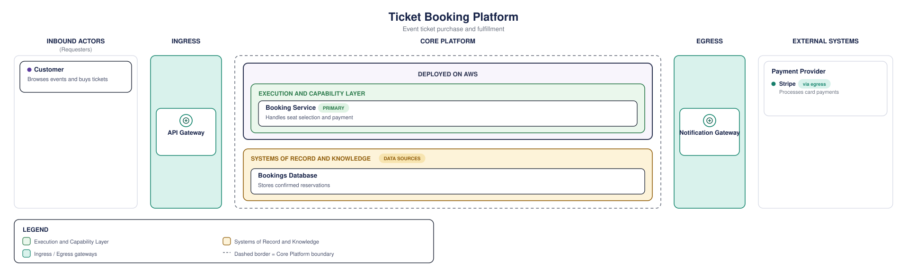

# ArchSmith

<p align="center">
  <a href="https://www.npmjs.com/package/@archsmith/cli"></a>
  <a href="https://github.com/ayeshLK/archsmith/actions/workflows/ci.yml"></a>
  <a href="https://github.com/ayeshLK/archsmith/blob/main/LICENSE"></a>
  = 20">
  
  <a href="https://m8ven.ai/mcp/ayeshlk-archsmith-nuc9ms"></a>
</p>

**ArchSmith turns a validated JSON description of a layered system architecture into a clean, consistent SVG diagram.** Feed it a structured document (an IR — intermediate representation), get back a diagram in a fixed, opinionated house style: no per-diagram layout decisions, no hand-drawn boxes, no drift between one architecture doc and the next.

It's built as a library first, a CLI on top of that, and an MCP server on top of that — so it's just as easy for a human to run `archsmith render` as it is for an AI agent to call it as a tool.

<p align="center">
  
</p>

<p align="center">
  
</p>

<p align="center"><sub>The session above builds <a href="examples/ticket-booking/diagram.archsmith.json"><code>ticket-booking</code></a> — the same reference example used throughout this README — with no hand-written JSON, saved as <a href="docs/demo/author-demo.archsmith.json"><code>author-demo.archsmith.json</code></a>.</sub></p>

> [!NOTE]
> ArchSmith is pre-1.0 — the schema and API may still change (`diagram-schema.json` itself is marked "first pass, expect revision"). See [releases](https://github.com/ayeshLK/archsmith/releases) for what's shipped in each version.

## Why

Drawing an architecture diagram by hand is slow and doesn't scale: every new diagram means re-deciding box shapes, colors, spacing, and layout from scratch, and keeping a whole set of diagrams visually consistent — a real "house style" — is a losing battle once more than one person is producing them. It's harder still now that agents, not just humans, increasingly need to produce these diagrams: an agent can't open a drawing tool and drag boxes around, but it can absolutely produce structured JSON.

Just asking an LLM to draw an SVG diagram directly doesn't fix this either — it trades manual inconsistency for a different kind, where the same request can come out looking different depending on the day, the model, or the prompt. ArchSmith separates those two concerns instead: an agent (or a human) does the *interpretation* — turning a sketch or a description into a valid structured document — and hands it to ArchSmith for deterministic rendering. Same input, same output, every time, with the house style (spacing, colors, text wrapping, box shapes) enforced by the renderer rather than re-decided per diagram — down to embedding the exact font text was measured against, so a diagram looks the same on any machine viewing it, not just the one that rendered it.

## How

ArchSmith currently supports one diagram convention: a layered/swimlane style that lays out a system's architecture as five columns, left to right:

1. **Inbound Actors** — who or what calls into the system (end users, other apps, partner integrations).
2. **Ingress** — the API gateway/edge layer requests come in through.
3. **Core Platform** — the backend itself: API-management/identity concerns, the actual business-logic services, an optional domain-model layer, and the platform's own databases/files ("Systems of Record").
4. **Egress** — the gateway layer through which the platform calls *out* to other systems.
5. **External Systems** — downstream dependencies reached via egress, grouped into named clusters.

Every color, box shape, spacing rule, and text-wrapping decision in that layout was pixel-measured against real reference diagrams, not guessed — see [`packages/schema/README.md`](packages/schema/README.md) for how the sub-layer/color palette is governed as it grows.

Describing an architecture is just picking what goes in each column and writing it down: a title, a short description, and — for items with a role worth flagging, like "the primary database" or "only reached via egress" — a colored dot or a small pill tag. No coordinates, no manual layout, no font-size or spacing decisions to make; the renderer works out box sizes, text wrapping, and alignment from the content alone. See [the IR shape](#the-ir-shape) below for the actual JSON structure, and [Quick start](#quick-start) to render one.

## How it compares

Mermaid, PlantUML, and Structurizr (the C4 model's own tool) are the closest comparisons — text/data in, a rendered diagram out, no manual box-dragging. What's different about ArchSmith:

- **One fixed house style, not a general-purpose diagramming language.** Mermaid/PlantUML give you a flexible syntax and largely leave the visual result up to you (or a theme); ArchSmith's IR has no layout or styling knobs at all. The same title/description/color-token input always produces the same box shapes, spacing, and typography, because there's exactly one house style to conform to, not many to choose between.
- **MCP-first, not just a CLI.** The same `render`/`validate` capability is a callable MCP tool, with the schema and registries themselves readable as MCP resources — built for an agent to call as part of a larger workflow, not just for a human to paste into a `.mmd` file.
- **One diagram convention today.** Mermaid/PlantUML/Structurizr all support a broader range of diagram types (sequence diagrams, the full set of C4 levels, state machines) that ArchSmith doesn't attempt yet — see the [`roadmap`-labeled issues](https://github.com/ayeshLK/archsmith/issues?q=is%3Aissue+is%3Aopen+label%3Aroadmap) for where that could go.

If you want a flexible, general-purpose diagramming syntax, Mermaid or PlantUML are probably the better fit. If you want one specific layered-architecture house style enforced consistently across many diagrams — and want an agent to produce them as easily as a human can — that's what ArchSmith is for.

## Quick start

```bash
npm install -g @archsmith/cli
archsmith author
```

`archsmith author` is a guided, no-hand-written-JSON wizard: it walks you through Inbound Actors, Ingress, Core Platform, Systems of Record, Egress, and External Systems one plain-language question at a time, offering only governed colors/sub-layers so whole classes of validation error can't happen — then validates, renders, and saves the `.archsmith.json` and `.svg` next to each other. It's aimed at creating a valid *initial* diagram; editing an existing one isn't supported yet — hand-edit the saved JSON, or start a fresh session, if you spot a mistake afterward.

### Or start from an example

Name IR documents `*.archsmith.json` so editors and integrations can identify them without colliding with other JSON-based intermediate representations. The CLI remains filename-agnostic and accepts any JSON file path.

```bash
mkdir -p ticket-booking
curl -o ticket-booking/diagram.archsmith.json https://raw.githubusercontent.com/ayeshLK/archsmith/main/examples/ticket-booking/diagram.archsmith.json
archsmith validate ticket-booking/diagram.archsmith.json
archsmith render ticket-booking/diagram.archsmith.json -o ticket-booking/diagram.svg
```

Or without installing anything: `npx @archsmith/cli render ticket-booking/diagram.archsmith.json -o ticket-booking/diagram.svg`.

Working on ArchSmith itself rather than just using it? See [CONTRIBUTING.md](CONTRIBUTING.md) for building from a clone.

## CLI usage

```bash
archsmith author
archsmith validate <input.archsmith.json> [--json]
archsmith render <input.archsmith.json> -o <out.svg> [--no-embed-fonts] [--pretty]
archsmith registries list
archsmith registries show <sub-layers|colors|icons> [--family standard|accessible]
archsmith schema show
```

- `author` launches the interactive wizard covered in [Quick start](#quick-start) above. It needs a real terminal — a piped/non-interactive invocation (e.g. CI) fails with one clear line rather than hanging.
- `render` validates the IR first and fails the same way `validate` would (exit 1) if it's invalid; a rendering-time error exits 2.
- `--no-embed-fonts` skips embedding the bundled font, producing a smaller file.
- `--pretty` indents the output SVG's element lines for readability (default is one element per line, unindented).
- `registries show colors --family standard` prints just that color family instead of the whole registry. The planned `accessible` registry can be inspected, but diagrams cannot select it until its complete palette is designed and tested.
- `schema show` prints the raw `diagram-schema.json` contents — the structural contract an IR document must satisfy, as distinct from the governed vocabulary `registries` exposes.

<p align="center">
  
</p>

<p align="center"><sub>Already have an IR document (hand-written, agent-authored, or saved from <code>archsmith author</code>)? <code>validate</code> and <code>render</code> are the two commands you need.</sub></p>

## Using it as a library

```ts
import { render, validate } from "@archsmith/renderer";

const result = validate(ir); // { valid: boolean, errors: string[] }
if (result.valid) {
  const svg = render(ir); // complete SVG document, as a string
}
```

## MCP server

`@archsmith/mcp-server` exposes the same capability as the CLI, over MCP instead of argv — a sibling of the CLI, not a wrapper around it: both call `render()`/`validate()` from `@archsmith/renderer` directly. It communicates over stdio, so an MCP host spawns it as a subprocess and talks JSON-RPC over stdin/stdout, the same way a shell would spawn `archsmith` and read its stdout — except the process stays alive across many calls instead of exiting after one.

**Tools**: `get_schema`, `render`, `validate`, `list_registries`, `get_registry` (mirrors the CLI's own commands — same validate-before-render behavior, same `family` filter on `get_registry`). `render` defaults to `embedFonts: false`, keeping the normal agent path compact. Pass `embedFonts: true` deliberately when the exported SVG must carry the bundled Arimo font and render identically without installed fonts; the embedded font is subset to just the glyphs that diagram's text needs (see issue #55), so the size added scales with the diagram rather than a fixed cost — still worth opting into deliberately rather than by default, but no longer a blind ~40 KB tax regardless of content. A render still under 25,000 bytes of SVG comes back as one text content block; a larger one — a big diagram, or `embedFonts: true` on one — comes back as a `resource_link` instead, fetchable via `resources/read`, so the tool result itself never grows unbounded regardless of diagram size. This MCP-specific behavior does not change the renderer library or CLI, which continue to embed fonts by default and return the SVG directly. `get_schema` returns the same JSON Schema as the `archsmith://schema` resource below, as a tool — the connected model can call it on its own initiative before authoring an IR, without depending on the host client to surface a resource; `validate`/`render` point at it and at `get_registry` in their own descriptions, and again in the response when the IR is invalid.

**Resources**: `archsmith://schema` and one `archsmith://registries/<name>` per governed registry — lets an agent authoring an IR read the live, current schema/registries directly instead of working from a stale copy baked into a prompt. `render` also dynamically registers an `archsmith://render/<id>` resource for any render large enough to need one (see Tools above); it's not enumerable via `resources/list` — only reachable via the `resource_link` `render` itself returns — and is held in a small in-memory, bounded cache (the most recent 20 renders) rather than persisted, so it doesn't survive a server restart and older entries get evicted once a session renders past that cap.

**Recommended authoring workflow for a connected agent:** read the schema (`get_schema`) → read the relevant registries (`get_registry`) → construct an IR → `validate` → `render`.

For an inspectable real run of that complete workflow—including the original plain-English requirement, clarification exchange, published MCP configuration, privacy-reviewed tool sequence, final IR/SVG, and a published-action CI consumer—see the [agent-authored architecture diagram example](examples/agent-authored-architecture-diagram/README.md).

To connect it to an MCP host (e.g. Claude Desktop's `claude_desktop_config.json`):

```json
{
  "mcpServers": {
    "archsmith": {
      "command": "npx",
      "args": ["-y", "@archsmith/mcp-server"]
    }
  }
}
```

Working from a clone instead (e.g. to test a local change)? Point at the built entrypoint directly:

```json
{
  "mcpServers": {
    "archsmith": {
      "command": "node",
      "args": ["/absolute/path/to/archsmith/packages/mcp-server/dist/index.js"]
    }
  }
}
```

<p align="center">
  
</p>

<p align="center"><sub>Because the schema and registries are themselves MCP resources (not a copy baked into a prompt), an agent can turn a plain-English requirement straight into IR — reading them live, asking about whatever the description leaves ambiguous, then calling <code>validate</code> and <code>render</code> once it has enough to draft a schema-conformant document. No archsmith-side LLM call involved: the interpretation happens in the connected agent, archsmith stays a deterministic renderer.</sub></p>

The GIF is a condensed presentation. The [agent-authored example](examples/agent-authored-architecture-diagram/README.md) is the reproducible, inspectable evidence; any edited demo derived from such a run should link back to its retained artifacts.

## The IR shape

An IR document is a JSON object with five columns, an optional legend, and optional notes. The schema is published at [`schema/latest/diagram-schema.json`](https://ayeshlk.github.io/archsmith/schema/latest/diagram-schema.json), with immutable versioned copies such as [`schema/0.3.4/diagram-schema.json`](https://ayeshlk.github.io/archsmith/schema/0.3.4/diagram-schema.json). Use a versioned URL in committed documents for reproducible editor validation; the `latest` URL is intended for tooling that should follow the newest schema.

Name your file `*.archsmith.json` and [SchemaStore](https://www.schemastore.org/) gives you autocomplete and inline validation automatically in VS Code, JetBrains IDEs, and other SchemaStore-aware editors — no `$schema` line required. See [`packages/schema/README.md`](packages/schema/README.md#editor-support) for the manual `$schema` fallback.

This is the actual minimal valid fixture from `examples/`:

```json
{
  "$schema": "https://ayeshlk.github.io/archsmith/schema/0.3.4/diagram-schema.json",
  "schemaVersion": "0.3.4",
  "title": "Minimal Example — Architecture",
  "subtitle": "A minimal fixture proving the validation pipeline end to end",
  "colorTheme": { "family": "standard" },
  "columns": {
    "inboundActors": {
      "items": [
        { "title": "Web App", "dotColor": "purple", "descriptionLines": ["React SPA"] }
      ]
    },
    "ingress": { "gateway": { "label": "API Gateway", "sublabel": "Production Runtime" } },
    "corePlatform": {
      "deployedOn": "Production Runtime",
      "subLayers": [
        { "registryId": "execution-and-capability", "rows": [[{ "title": "Backend Service", "descriptionLines": ["REST APIs"] }]] }
      ],
      "systemsOfRecord": { "registryId": "systems-of-record", "items": [{ "title": "Primary DB", "descriptionLines": ["PostgreSQL"] }] }
    },
    "egress": { "gateway": { "label": "API Gateway", "sublabel": "Outbound M2M" } },
    "externalSystems": {
      "clusters": [
        { "name": "Shared Internal Services", "items": [{ "title": "Email Service", "dotColor": "teal", "descriptionLines": ["Notifications"] }] }
      ]
    }
  },
  "legend": { "entries": [{ "colorToken": "green", "label": "Execution and Capability Layer" }] }
}
```

The full schema (`packages/schema/diagram-schema.json`) and governed registries (`packages/schema/registries/`) define every field and every allowed color/sub-layer token — see `packages/schema/README.md` for the governance model. `examples/ticket-booking/README.md` is a richer, fully-featured reference document, and [`examples/README.md`](examples/README.md) is the gallery index for additional fictional fixtures.

## Packages

This is an npm workspaces monorepo — each package does one job, and only the layer above it knows the layer below exists:

| Package | What it does |
|---|---|
| [`@archsmith/schema`](packages/schema) | The IR schema (JSON Schema draft 2020-12) plus governed registries (sub-layers, colors, icons). Versioned independently — adding a registry entry is a deliberate change-request, not a per-diagram decision. |
| [`@archsmith/renderer`](packages/renderer) | Validates an IR against the schema/registries and renders it to SVG. Pure function, no I/O beyond reading its own bundled font, no LLM dependency. |
| [`@archsmith/cli`](packages/cli) | `archsmith` binary — `validate`, `render`, `registries list\|show`, `schema show`. |
| [`@archsmith/mcp-server`](packages/mcp-server) | `archsmith-mcp` binary — exposes `render`/`validate`/`get_schema`/registry lookups over MCP (stdio transport) so any MCP-capable agent can call them as tools. |

## Support

Questions, or something not working the way this README says it should? [Open a GitHub issue](https://github.com/ayeshLK/archsmith/issues). Report suspected vulnerabilities privately through the [security policy](SECURITY.md), not through public issues.

## Contributing

Contributions are welcome — see [CONTRIBUTING.md](CONTRIBUTING.md) for how to build/test locally and, importantly, the governance rules around changing the schema or registries (this is what keeps the output a consistent house style rather than free-form per-diagram layout). Participation is governed by the [Code of Conduct](CODE_OF_CONDUCT.md). If you're an AI coding agent, see [AGENTS.md](AGENTS.md) too. Planned work and open directions are tracked as [GitHub issues](https://github.com/ayeshLK/archsmith/issues) — [`roadmap`](https://github.com/ayeshLK/archsmith/issues?q=is%3Aissue+is%3Aopen+label%3Aroadmap) for bigger capability directions (new diagram notations, pluggable styles), narrower labels (`schema`, `mcp-server`, `release`) for everything else.

## License

[Apache-2.0](LICENSE)
