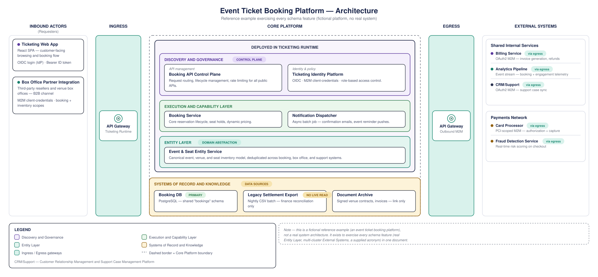

# ArchSmith

<p align="center">
  <a href="https://github.com/ayeshLK/archsmith/actions/workflows/ci.yml"></a>
  <a href="https://github.com/ayeshLK/archsmith/blob/main/LICENSE"></a>
  = 20">
  
</p>

**ArchSmith turns a validated JSON description of a layered system architecture into a clean, consistent SVG diagram.** Feed it a structured document (an IR — intermediate representation), get back a diagram in a fixed, opinionated house style: no per-diagram layout decisions, no hand-drawn boxes, no drift between one architecture doc and the next.

It's built as a library first, a CLI on top of that, and (soon) an MCP server on top of that — so it's just as easy for a human to run `archsmith render` as it is for an AI agent to call it as a tool.

<p align="center">
  
</p>

<p align="center"><sub>Rendered from <a href="examples/ticket-booking.ir.json"><code>examples/ticket-booking.ir.json</code></a> — a fictional example exercising every schema feature.</sub></p>

## Why

The diagram format itself — Inbound Actors → Ingress → Core Platform → Egress → External Systems, with a governed color/sub-layer palette — comes from a hand-tuned prototype whose every rendering rule (text wrapping, box sizing, the gateway icon, column framing, a 3-tier width/wrap/acronym fallback) was pixel-measured against real reference diagrams, not guessed. ArchSmith generalizes that into a reusable renderer.

Along the way, rebuilding it surfaced a real bug worth designing around: the prototype measured text width against one font but declared a different one in the output SVG's CSS, so wrapping decisions were correct on the machine that made them and subtly off everywhere else. ArchSmith fixes this at the root — it measures against a bundled font (Arimo, metric-compatible with Arial) and, by default, embeds that exact font into the output SVG, so a diagram looks the same regardless of what's installed on the machine viewing it.

The renderer itself is a pure function — IR in, SVG out, no LLM call inside it. That's deliberate: an agent (or a human) does the *interpretation* — turning a sketch or a description into a valid IR — and hands it to ArchSmith for deterministic rendering. The registries (which colors, which sub-layer types are allowed) are governed and versioned separately, so extending the format is a reviewable change, not something a generation step decides for itself.

## Quick start

```bash
git clone https://github.com/ayeshLK/archsmith.git
cd archsmith
npm install
npm run build

npx archsmith validate examples/ticket-booking.ir.json
npx archsmith render examples/ticket-booking.ir.json -o ticket-booking.svg
```

(Not yet published to npm — see [Project status](#project-status) — so for now this only works from a clone, via the workspace-linked `archsmith` bin.)

## CLI usage

```bash
archsmith validate <input.json> [--json]
archsmith render <input.json> -o <out.svg> [--no-embed-fonts] [--pretty]
archsmith registries list
archsmith registries show <sub-layers|colors|icons> [--family standard|accessible]
```

- `render` validates the IR first and fails the same way `validate` would (exit 1) if it's invalid; a rendering-time error exits 2.
- `--no-embed-fonts` skips embedding the bundled font, producing a smaller file.
- `--pretty` indents the output SVG's element lines for readability (default is one element per line, unindented).
- `registries show colors --family standard` prints just that color family instead of the whole registry.

## Using it as a library

```ts
import { render, validate } from "@archsmith/renderer";

const result = validate(ir); // { valid: boolean, errors: string[] }
if (result.valid) {
  const svg = render(ir); // complete SVG document, as a string
}
```

## The IR shape

An IR document is a JSON object with five columns, a legend, and optional notes. This is the actual minimal valid fixture from `examples/`:

```json
{
  "schemaVersion": "0.1.0",
  "title": "Minimal Example — Architecture",
  "subtitle": "A minimal fixture proving the validation pipeline end to end",
  "colorTheme": { "family": "standard" },
  "columns": {
    "inboundActors": {
      "items": [
        { "title": "Web App", "dotColor": "purple", "descriptionLines": ["React SPA"] }
      ]
    },
    "ingress": { "gateway": { "label": "API Gateway", "sublabel": "Production Runtime" } },
    "corePlatform": {
      "deployedIn": "Production Runtime",
      "subLayers": [
        { "registryId": "execution-and-capability", "rows": [[{ "title": "Backend Service", "descriptionLines": ["REST APIs"] }]] }
      ],
      "systemsOfRecord": { "items": [{ "title": "Primary DB", "descriptionLines": ["PostgreSQL"] }] }
    },
    "egress": { "gateway": { "label": "API Gateway", "sublabel": "Outbound M2M" } },
    "externalSystems": {
      "clusters": [
        { "name": "Shared Internal Services", "items": [{ "title": "Email Service", "dotColor": "teal", "descriptionLines": ["Notifications"] }] }
      ]
    }
  },
  "legend": { "entries": [{ "colorToken": "green", "label": "Execution and Capability Layer" }] }
}
```

The full schema (`packages/schema/diagram-schema.json`) and governed registries (`packages/schema/registries/`) define every field and every allowed color/sub-layer token — see `packages/schema/README.md` for the governance model. `examples/ticket-booking.ir.json` is a richer, fully-featured reference document.

## Packages

This is an npm workspaces monorepo — each package does one job, and only the layer above it knows the layer below exists:

| Package | What it does |
|---|---|
| [`@archsmith/schema`](packages/schema) | The IR schema (JSON Schema draft 2020-12) plus governed registries (sub-layers, colors, icons). Versioned independently — adding a registry entry is a deliberate change-request, not a per-diagram decision. |
| [`@archsmith/renderer`](packages/renderer) | Validates an IR against the schema/registries and renders it to SVG. Pure function, no I/O beyond reading its own bundled font, no LLM dependency. |
| [`@archsmith/cli`](packages/cli) | `archsmith` binary — `validate`, `render`, `registries list\|show`. |
| [`@archsmith/mcp-server`](packages/mcp-server) | Exposes `render`/`validate`/registry lookups over MCP so any MCP-capable agent can call them as tools. **Not yet built.** |

## Project status

- [x] **Phase 0** — schema + registries + `archsmith validate`
- [x] **Phase 1** — font measurement (bundled Arimo via `fontkit`, no OS-specific font paths)
- [x] **Phase 2** — SVG primitives and box-drawing functions
- [x] **Phase 3** — full layout assembly + golden-master regression test
- [x] **Phase 4** — CLI polish (font embedding by default, `--pretty`, registry filtering)
- [ ] **Phase 5** — MCP server

## Contributing

Contributions are welcome — see [CONTRIBUTING.md](CONTRIBUTING.md) for how to build/test locally and, importantly, the governance rules around changing the schema or registries (this is what keeps the output a consistent house style rather than free-form per-diagram layout).

## License

[Apache-2.0](LICENSE)
